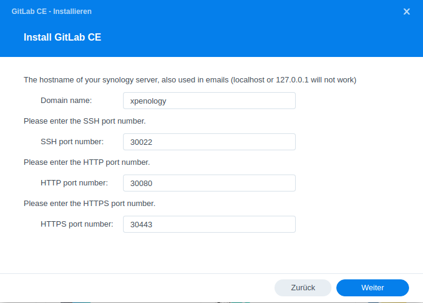
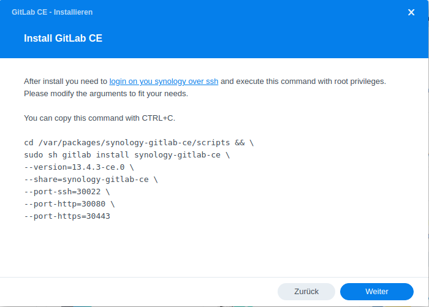
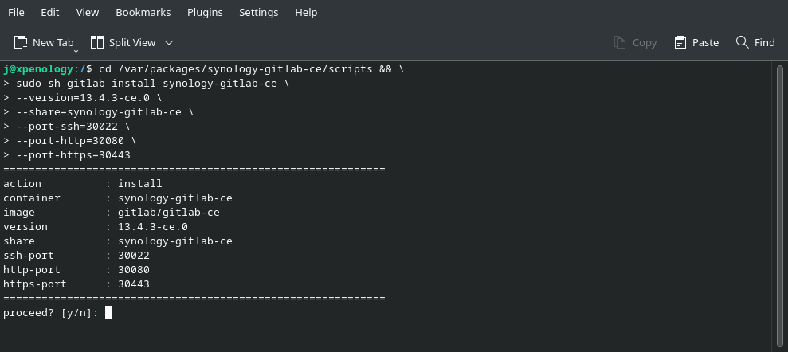
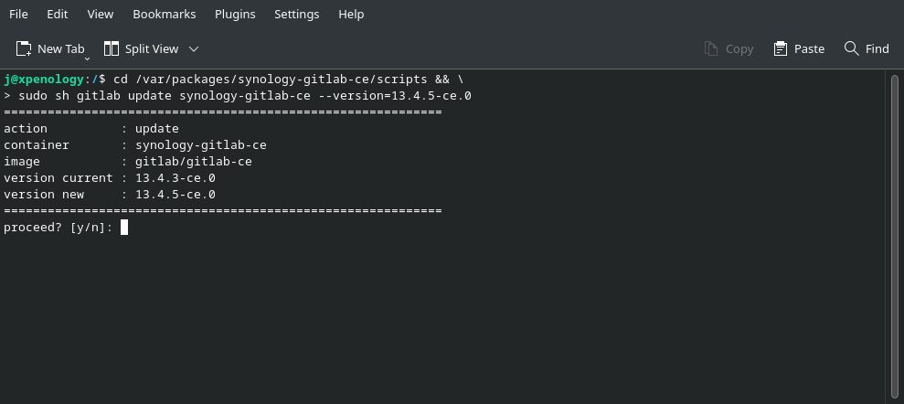

## synology-gitlab-ce

This is a docker based GitLab CE package for Synology NAS server using the original [gitlab/gitlab-ce](https://hub.docker.com/r/gitlab/gitlab-ce/) image from hub.docker.com. 
The goal of this project is to lower the entry barrier for new GitLab users and give experienced users a little comfort in maintaining their GitLab installation.     

Everything this package does, can be also done manually over the Synology Docker NAS Application.    

Please note that I can not give you support for GitLab itself, this project covers only the Synology installation/update routines.
If you need GitLab Support you might get it here [https://forum.gitlab.com](https://forum.gitlab.com). 

### Hardware Requirements:
- 1 CPU core ( 2 cores is recommended )
- 2 GB RAM ( 4GB RAM is recommended )


### Classic:
very simplistic package, installation and basic configuration over DSM, no ssh or root privileges 
required. But this comes with a tradeoff, container configuration (ports,volumes,etc.) after the installation is not 
possible. This is because of the DSM no root privilege policy. However the settings can be changed but only by uninstalling
and reinstalling the package again. During uninstallation of this package all data will be deleted by DSM. Please do not 
forget to backup before. Upgrade to Advanced is possible, but be careful and backup, backup, backup!

<span style="color:red">WARNING: </span> All gitlab data will be deleted on uninstall! Backup berfore uninstalling!



### Advanced: 
this approach bypass the root privileges limitation of the DSM by running the setup over ssh. The final container 
runs exactly with the same privileges and setup as the classic non-root approach but you need to execute the installer 
as root to get the setup done. This is a more flexible variant because this way you get the full access to the container
settings and an update simply exports you current container configuration and imports it again with a modified GitLab image version.
This way all your configuration remains the same and you can downgrade and upgrade as you like. As far as GitLab supports the downgrade
with your specific dataset. The ssh installer/updater gives you also the ability to run multiple gitlab container instances with 
different container/versions and different data shares. You can test your upgrades and migrations without andy risk and downtime.



**Install Instance**


**Update Instance**


**Multiple Instances**


### Overview Advanced vs Classic
| Feature                                                   | Advanced | Classic |
|-----------------------------------------------------------|:--------:|:-------:|
| DSM only install                                          | &cross;  | &check; |
| requires ssh for install                                  | &check;  | &cross; |
| requires root privileges                                  | &check;  | &cross; |
| gitlab can be upgraded                                    | &check;  | &check; |
| gitlab can be downgraded                                  | &check;  | &cross; |
| multiple parallel gitlab instances                        | &check;  | &cross; |
| start/stop over package control                           | &cross;  | &check; |
| start/stop over docker app                                | &check;  | &cross; |
| exposed gitlab configuration and data                     | &check;  | &check; |
| container settings accessible                             | &check;  | &cross; |
| access to container environment variables                 | &check;  | &cross; |
| keeps container settings (ports,volumes,links) on updates | &check;  | &cross; |
| GitLab files remains on package uninstall                 | &check;  | &cross; |

### Build instructions
Clone this repository and execute the build script
```bash
# Syntax: build <version> [options]
# arguments:
#   version - GitLab CE version e.g. 13.4.3-ce.0
# options:
#   --type  - package type (classic|advanced) - default: classic
#   --dsm   - target DSM version (6|7) - default: 7

./build 13.4.3-ce.0 --dsm=7 --type=classic
```

### Advanced Installer/Updater
```bash
# Location: /var/packages/synology-gitlab-ce/scripts
# Syntax: gitlab <action> [<container>] [options]
# arguments:
#   action       - install or update
#   container    - container name
# options:
#   --version    - GitLab CE version e.g. 13.4.3-ce.0
#   --share      - destination folder which will contain shared gitlab files
#   --port-ssh   - ssh host port
#   --port-http  - http host port
#   --port-https - https host port

# install
cd /var/packages/synology-gitlab-ce/scripts && \
sudo sh gitlab install synology-gitlab-ce \
--version=13.4.3-ce.0 \
--share=synology-gitlab-ce \
--port-ssh=30022 \
--port-http=30080 \
--port-https=30443

# update
cd /var/packages/synology-gitlab-ce/scripts && \
sudo sh gitlab update synology-gitlab-ce --version=13.4.5-ce.0
```

### Connect into container
If you want to bash into your gitlab container you can do this with this command
```bash
sudo docker exec -it "<gitlab-container-name>" bash 
```

### GitLab Configuration
For configuration of the omnibus based GitLab image please refer to this documentation [https://docs.gitlab.com/omnibus/settings](https://docs.gitlab.com/omnibus/settings).
```bash
# after any change to the gitlab configuration you need to reconfigure 
# gitlab and restart the services, which can be done with this two 
# commands from your ssh terminal   

sudo docker exec -t "<gitlab-container-name>" bash -c "gitlab-ctl reconfigure"
sudo docker exec -t "<gitlab-container-name>" bash -c "gitlab-ctl restart"
```

### SSL (self-signed) helper
This helper installs for you a self-signed SSL certificate to your gitlab container and configures your gitlab to use this. 
Please do not use this for public accessible instances, this approach only makes sense if you run your GitLab private on 
your LAN and you're lazy to do a proper SSL certificate and install it. In any other case i recommend you to use 
the [GitLab Let's Encrypt](https://docs.gitlab.com/omnibus/settings/ssl.html#lets-encrypt-integration) integration.
```bash
# Location: /var/packages/synology-gitlab-ce/scripts
# Syntax: gitlab-self-signed-cert <action> [<container>] [options]
# arguments:
#   action       - install
#   container    - container name
# options:
#   --hostname   - gitlab hostname - default: xpenology
#   --https-port - https port - default: 80443

cd /var/packages/synology-gitlab-ce/scripts && \
sudo sh gitlab-self-signed-cert install synology-gitlab-ce \
  --hostname=xpenology --https-port=80443
```

### Shortcut helper
If your GitLab shortcut in your DSM got broken or points to the wrong container (port) you can fix it with this helper anytime.
```bash
# Location: /var/packages/synology-gitlab-ce/scripts
# Syntax: gitlab-link-fix [options]
# options:
#   --protocol   - protocol http|https - default: http
#   --port       - port - default: 30080

cd /var/packages/synology-gitlab-ce/scripts && \
sudo sh gitlab-link-fix --protocol=https --port=30443
```

### Backup
Please refer to this documentation [here](https://docs.gitlab.com/omnibus/settings/backups.html).
It is not recommended to store data backups in the same location as your config/credentials backup. Because of this, the 
backup process is split into two steps, the config backup and the data backup.
```bash
# backup gitlab configuration
# you will find you backups in this folder 
# /docker/<gitlab-container-share>/config/config_backup 
sudo docker exec -it "<gitlab-container-name>" gitlab-ctl backup-etc

# backup gitlab data (repositories and content)
# you will find you backups in this folder 
# /docker/<gitlab-container-share>/data/backups
sudo docker exec -it "<gitlab-container-name>" gitlab-backup 
```

### Restore
Please refer to the GitLab documentation [here](https://docs.gitlab.com/ee/raketasks/backup_restore.html#restore-gitlab).
```bash
# restore gitlab configuration
# unzip your configuration backup to the config folder overwriting existing files 
# config folder: /docker/<gitlab-container-share>/config
# after that you can continue with the data restore

# restore gitlab data
# copy your data backup to the data/backups folder 
# /docker/<gitlab-container-share>/data/backups
sudo docker exec -it "<gitlab-container-name>" gitlab-ctl stop puma   
sudo docker exec -it "<gitlab-container-name>" gitlab-ctl stop sidekiq
# verify puma & sidekiq are down
sudo docker exec -it "<gitlab-container-name>" gitlab-ctl status    
# fix permissions
sudo docker exec -it "<gitlab-container-name>" chown git:git /var/opt/gitlab/backups/1647529095_2022_03_17_13.4.3_gitlab_backup.tar
# restore, please omit the "_gitlab_backup.tar" from the backup archive name
sudo docker exec -it "<gitlab-container-name>" gitlab-backup restore BACKUP=1647529095_2022_03_17_13.4.3

# restart the GitLab container
sudo docker restart "<gitlab-container-name>"

# check GitLab
sudo docker exec -it "<gitlab-container-name>" gitlab-rake gitlab:check SANITIZE=true
```
